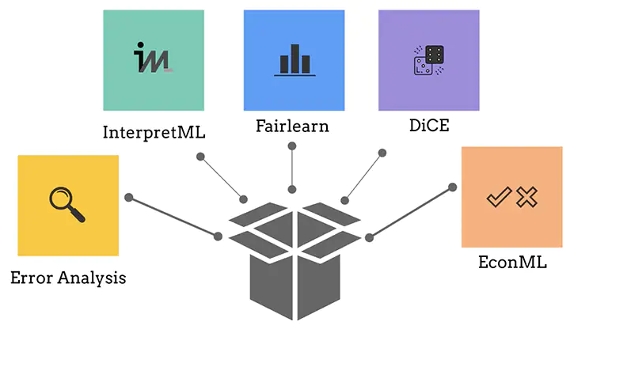
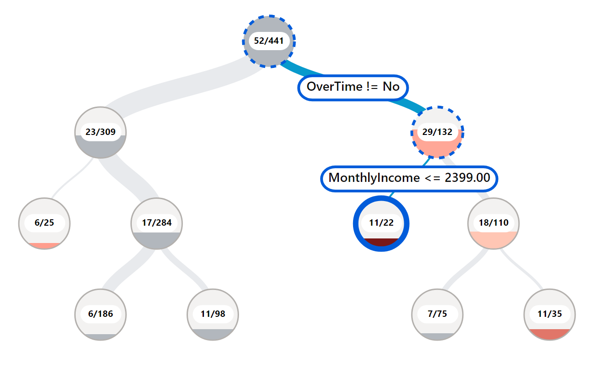
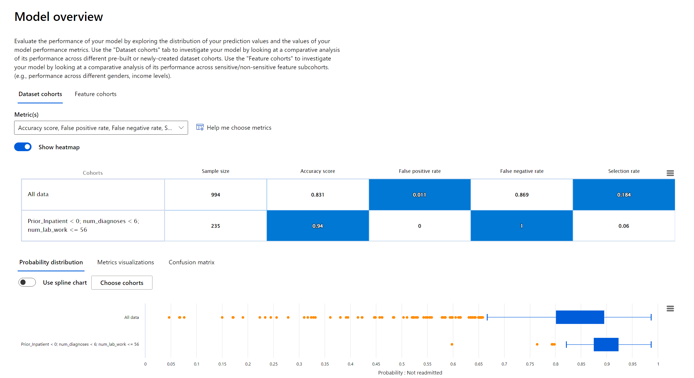
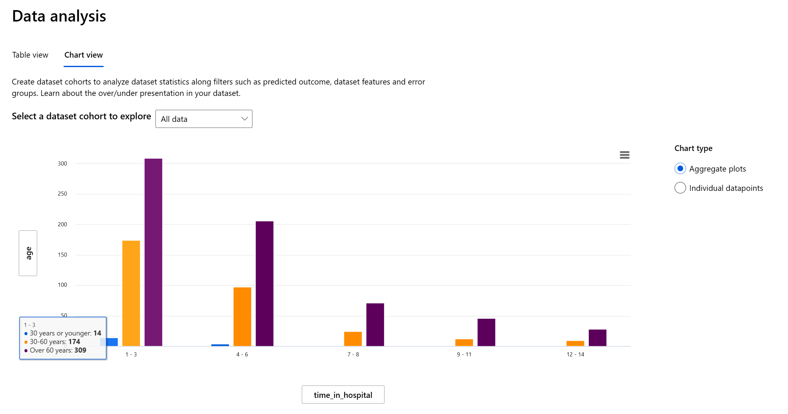
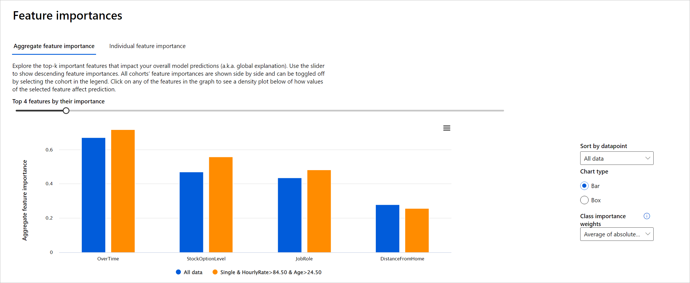
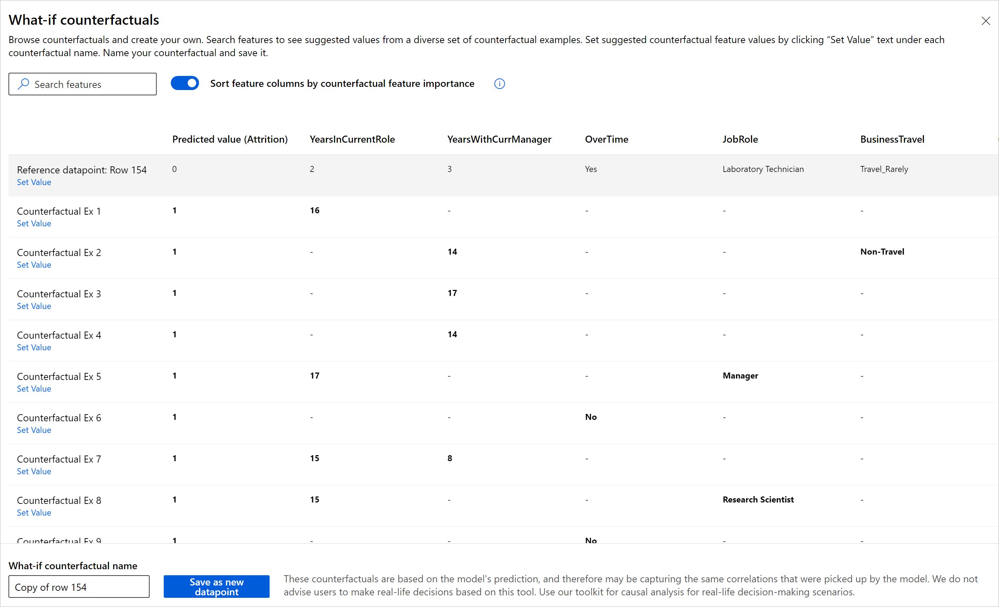

# responsibleai-diabetes-hospital-readmission-classification
Creating an Azure Machine Learning Responsible AI dashboard with a trained classification model for diabetes hospital readmission

# RAI-Employment-Attrition-Classification

## Buisiness Use Case Overview
The project contain data and notebook scripts to train a classification model that we’ll use to analyze and resolve issues we find using Azure Machine Learning studio's new Responsible AI (RAI) dashboard. We will be using a Diabetes Hospital Readmission dataset to predict whether a diabetic patient will be Readmitted or Not Readmitted back in a hospital < 30 days after being discharged. In addition, we’ll implement using best practices on creating an end-to-end machine learning workflow, with Azure ML components and pipelines. Azure ML components are reusable independent units of tasks that have inputs and output in machine learning (e.g., data cleaning, training a model, registering a model, deploying a model etc.). An Azure ML pipeline packages all the components and runs them sequentially during runtime with a specified compute instance, docker images or conda environments in the job process.

## Data
We’ll be using the [UCI's Diabetes 130-US hospitals for years 1999–2008](https://archive.ics.uci.edu/ml/datasets/Diabetes+130-US+hospitals+for+years+1999-2008#) dataset

## Prerequisites
- Login or Signup for a [FREE Azure account](https://aka.ms/MBFreeAzureAccount)

## What is Azure's Responsible AI dashboard?

Azure Responsible AI (RAI) dashboard is a new feature within Azure Machine Learning studio. It is implement using Responsible AI principles that help data scientists, AI developers and business stakeholders produce AI systems that are more fair, inclusive, transparent, accountable and reliable/safe. It is advantageous to have this new dashboard available within the Azure Machine Learning studio, as users train, debug, fix and deploy models in an end-to-end shared solution for team members in an organization to complete their tasks in the ML life cycle.

# Backend built using some OSS

The dashboard is built on some of machine learning’s best practice open-source tools for model debugging and assessment and responsible decision making that Microsoft and research community have been instrumental in developing — including ErrorAnalysis, InterpretML, Fairlearn, DICE, and EconML, for debugging and mitigating issues from AI models.

## How to use Error Analysis 

The Azure Responsible AI (RAI) dashboard Error Analysis section offers various ways of visualizing and investigating model errors. The following are the different features that make it easy for data scientists and AI developers to intuitively interact with the tool to debug their machine learning model:

- **Tree map**: a view that illustrates how the model failure is distributed across various cohorts. For example, a branch with high error nodes can be a cohort that needs further analysis. You can select any node to see the prediction path on your features where an error was found.

- **Heap map**: a different view of the error in the dataset. You can select one or many heat map cells and create new cohorts.
You can choose up to two features to create a heat map. It helps in highlighting attributes in the feature(s) where errors are coming from.

- **Feature List**: a list of feature names in the dataset the drove the model predictions that led to errors. The higher the important features in this list, the higher the error contribution. Note: Not to be confused with the “Feature Importance” section.

## How to use Model Overview

Model Overview enable data scientists and AI developers to perform comparative analysis between dataset cohorts or feature cohorts, which is vital in debugging a model to pinpoint where it’s having issues. This is especially important when one cohort has certain unique characteristics compared to another cohort. For example, discovering that the model is more erroneous with a cohort that has sensitive features (e.g., employee age, gender or marital status) can help expose potential unfairness the model may have.

## How to use Data Analysis

Data Analysis helps exposed data discrepancy that are usually a blind spot for tradition model performance metrics. Besides the stock options blind-shot, the Data Analysis section also help unveil other fairness and inclusive issues such as disparities in data features that are over or under represented in the dataset. All of these multiple angles that the RAI dashboard provides enables data scientists, AI developers and decision makers to debug, identify issues and mitigate to improve a model’s behavior and reduce any harm it could cause.

## How to use Feature Importance

The Feature Importance section of the RAI dashboard provides an interactive user interface (UI) that enables data scientists or AI developers to see top features in their dataset that drove a model’s prediction. In addition, it provides both global explanations and local explanations. With global explanation, the dashboard displays the top features that drove the model’s overall predictions. For local explanations, on the other hand, it shows which features drove a prediction for an individual data point. In our employment use case, every employee is different, so what drove the model to make a prediction for one employee can be different for another employee. The ability to explore local explanations is also helpful in debugging or auditing a specific case to better understand and interpret a model’s performance.

## How to use Counterfactuals

Counterfactual section that enables data scientists and decision-makers to observe the model’s prediction is a dataset and be able to generate a set of alternate examples with minimal changes to the original such that it’s able to change the model’s prediction. The capability shows the closest datapoints with opposite model precisions. In addition, the interactive user interface enables users to make custom what-if adjustments for individual data points to understand how the model reacts to data feature changes.

## How to use Casual Analysis

## How to work with Scorecard

## Useful References
- [Understanding RAI dashboard controls & settings](https://aka.ms/MBRAIdashboardControls)
- [Innovating Responsible AI: Videos, Projects, toolkits and Standards](https://www.microsoft.com/ai/ai-lab-responsible-ai-dashboard)

## Discussion
- How are you using RAI dashboard in your project?
- What is your feedback after trying out the dashboard?

